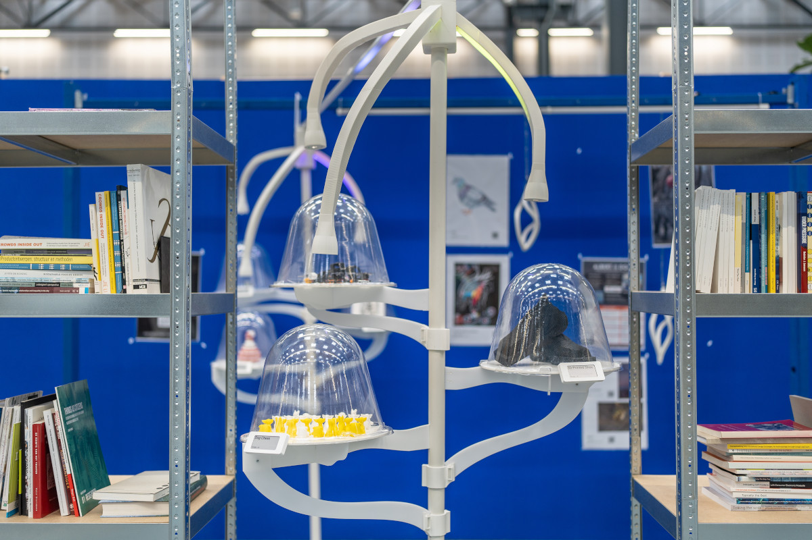

# Ideation Gallery

Sourcecode, and some of the fabrication files for the Ideation Gallery prototype.
Basic architecture is a Node.js server (`./server` directory) running on a Raspberry Pi. This also runs the central MQTT server (mosquitto).

ESP32 nodes are flashed with firmware from `./esp32`, initially through serial but after first boot through OTA. Exhibition layout is configured on the server in `./data/layout.json5`, which is sent to matching ESP32 nodes as they come online.
