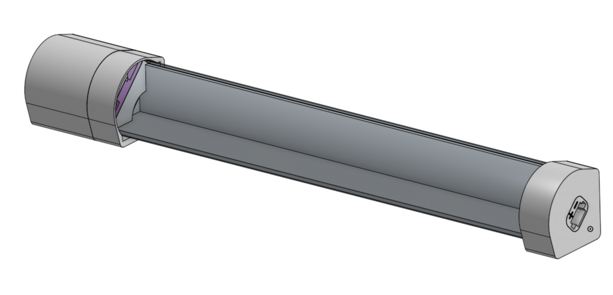

# Physical components
This directory houses some of the designs for the nodes used in the exhibition system.

<a href="./spirals-end/"><h2>Spirals end</h2></a>
  
ESP32 node with LED spot connected and powered through a WS2812b LED strip.

<a href="./ledbar/"><h2>Ledbar</h2></a>
  
2 meter long diffused LED strips held together with aluminium 20x20 profile. These connect nodes in the system over larger distances.

<a href="./hanging-spirals/"><h2>Hanging Spirals</h2></a>
  
Smaller spiralling light elements, linking poster showcases to the larger system.

<a href="./power/"><h2>Power</h2></a>
  
Unified power system based on 3-pin keyed headers.
