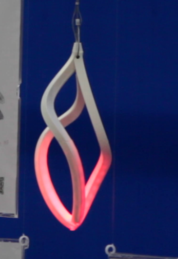

# Hanging spirals

Small spirals are printed in two halves, with a 3D printed diffuser glued on and cut to size after installing and soldering the WS2812 led strips. Small parts are for holding the 2mm steel cable, and holding the power, data, gnd cables cleanly against the cable.

These were re-used from the previous prototype, but now function to integrate the posters in the rest of the interactive recommendation system.