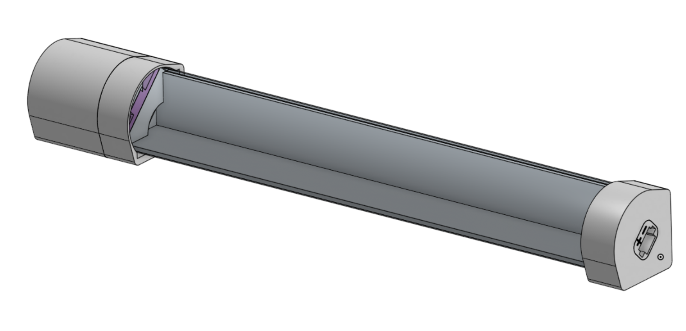
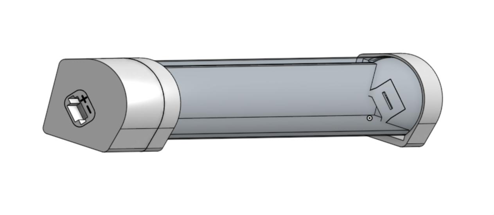
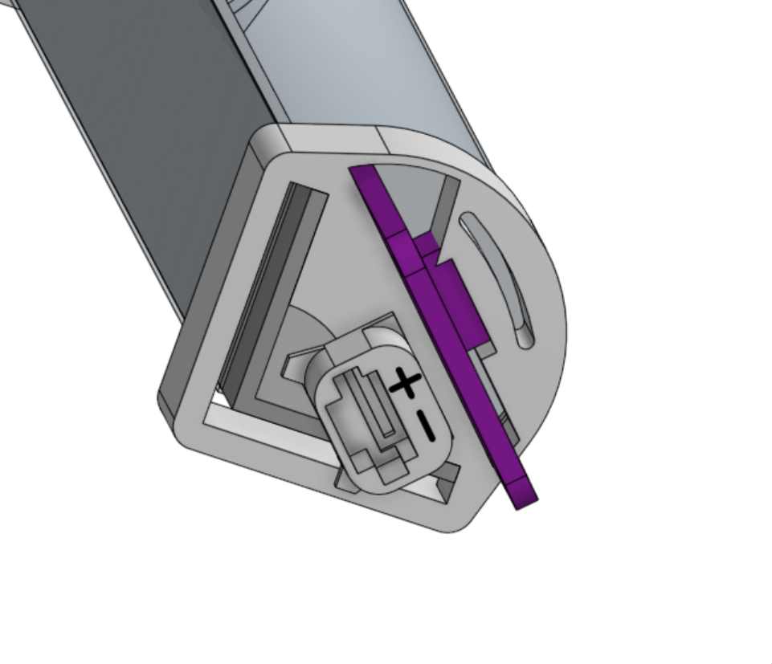
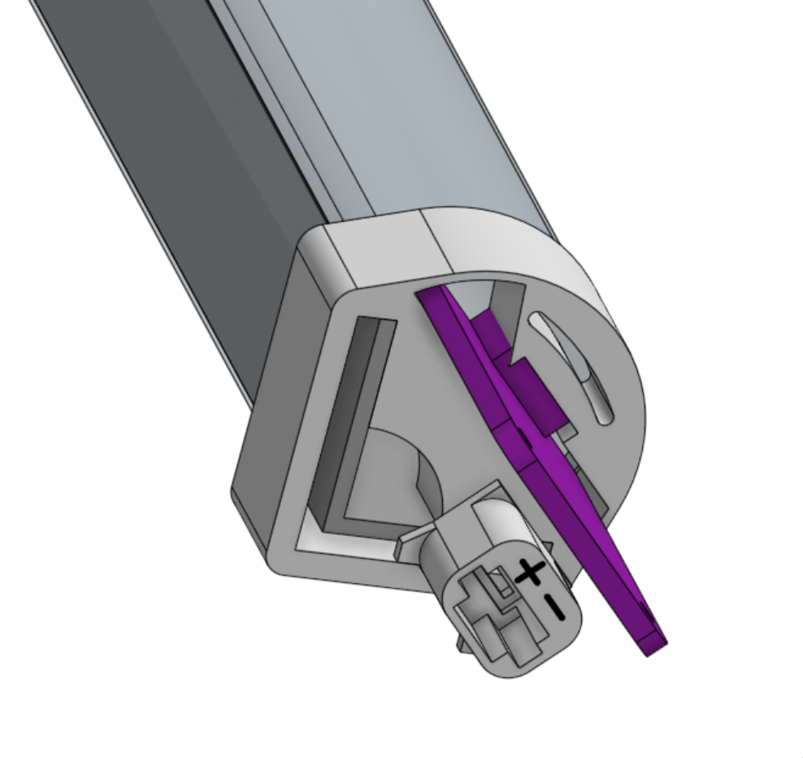

# Ledbar

[Onshape Document](https://cad.onshape.com/documents/6d58b01003095d4db1c09874/w/39b8cdf919015057da4c3701/e/dbecf34fd1b553dc5e3d9084?renderMode=0&uiState=65b7a7fc75a8a5702fdba146)

Uses 2x https://www.hornbach.nl/p/kaiserthal-hoekprofiel-20x20x1-5-mm-aluminium-zilver-200-cm/6069581/ profiles
to sandwich a diffuser made of 1 lasercut sheet of 0.28mm PP plastic combined with 2 layers of transferpaper.
3D printed end caps hold power connectors, and one side consists of 2 parts holding an ESP32 devboard to control the strip.

