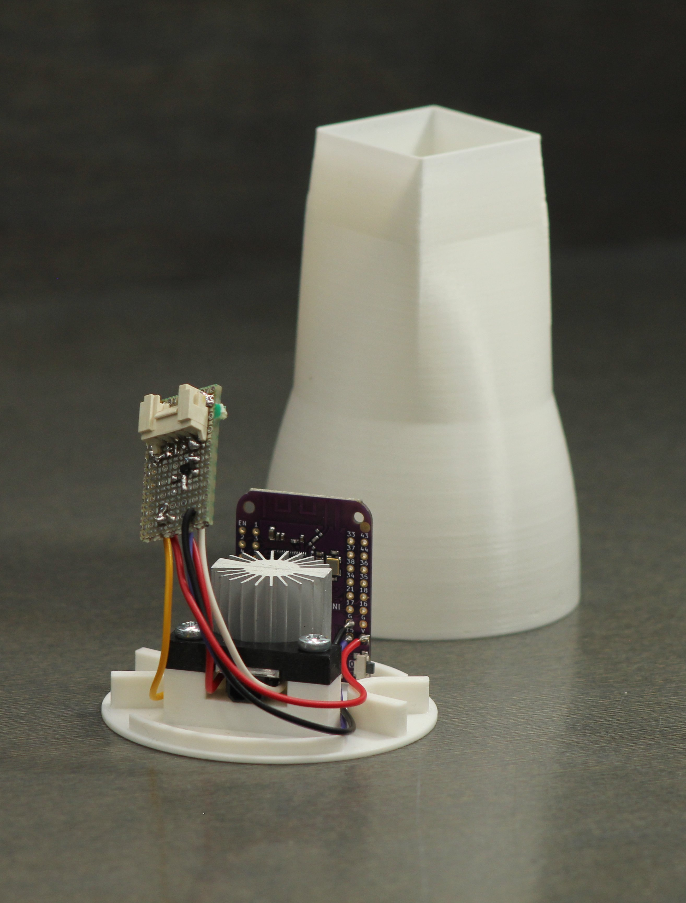

# Spirals-end

[Onshape document](https://cad.onshape.com/documents/177b1978831927715b1858db/w/a9c17a6f27e0b86a761d8910/e/372862695ea9a1eda356d827?renderMode=0&uiState=65b7a73075a8a5702fdb9e67)

These cases were redesigned to fit on the ends of the spirals extending above the project cases. Because of the previous architecture,
the WS2812 ledstrips inside are oriented with the data lines going up, so this endpiece houses the ESP32 that drives the strip, and a LED spot provided from the Philip Beesley workshop. 

Power is supplied through the top of the ledstrip, and the whole assembly is connected through a Grove connector at the end of the ledstrip. This connector is on a small protoboard with a MOSFET circuit to be able to drive the spot. 

